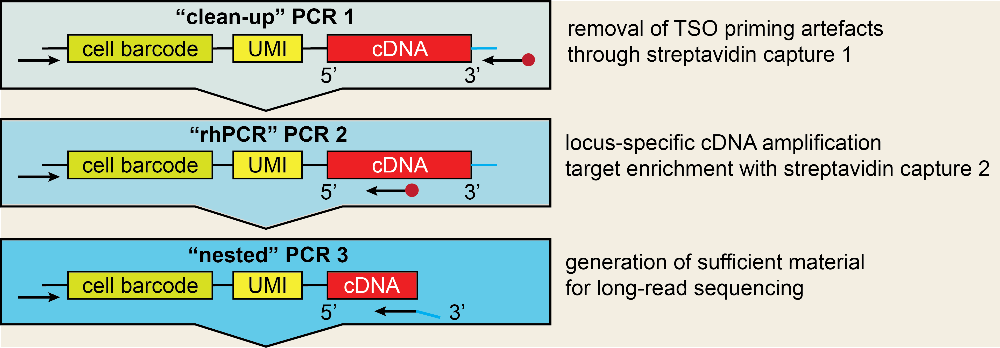

# nanoranger.R
R package for down-stream processing of [nanoranger](https://github.com/mehdiborji/nanoranger) output.

The package provides capabilities to read out single nucleotide variants, insertions/deletions,
fusion genes/CAR sequences and isoforms from amplicons sequenced with long-read sequencing with the *nanoranger* protocol. 

By using [starcode](https://github.com/gui11aume/starcode), UMIs that arise due to sequencing error are collapsed
in groups within a Levenshtein distance of 3. This is a strategy to deal with the issue that UMIs in 10x Genomics libraries
\- as opposed to cell barcodes \- do not have a whitelist that can be used for correcting sequencing error. 

For vignettes on how to use this package see [here](vignettes/README.md)

---

## Implemented functions

knee_plot(): plot knee plot to identify optimal cutoff for cells 
extract_mutation(): extraction of single nucleotide variants 
extract_indel(): extraction of insertions or deletions with specific length 
extract_length_diff(): detect truncated transcripts  
extract_fusion_gene(): extraction of fusion genes or CAR sequences 
extract_isoforms(): extraction of differentially spliced exons
