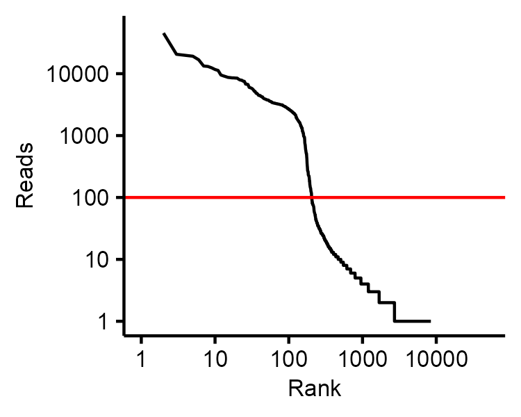
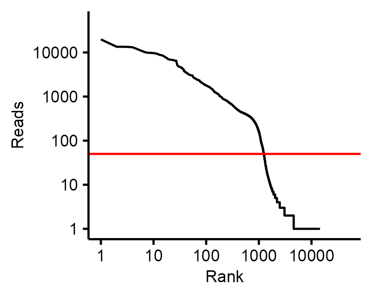
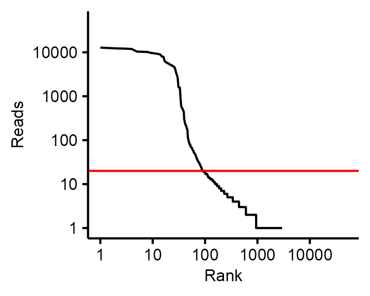

# Using nanoranger.R for variant calling

After processing the long-read data with nanoranger and performing the pileup of reads (perform_pileup.py) 
aligning with the locus of interest, the R package will be used for the actual variant calling.

## single nucleotide variants 

To extract single nucleotide variants, we need to first define a cut-off that will be used to identify cell barcodes 
that likely represent high-quality events in the targeted sequencing library. 

In general, the higher the cut-off, the more stringent low-quality cells represented by chimeric reads will be excluded.  

`knee_plot(x = data.table::fread('./vignettes/data/1002_pileup_TP53_1.csv.gz'), cutoff = 20)` 
`knee_plot(x = data.table::fread('./vignettes/data/1002_pileup_U2AF1.csv.gz'), cutoff = 20)`

 

After having identified a cut-off, the actual variant calling can be performed. By using the `downsample = ...` parameter,
we can speed things up for illustration purposes (in that case, the cut-off should also be changed). 

`TP53 = extract_mutation(BC.data.file = './vignettes/data/1002_pileup_TP53_1.csv.gz', REF = 'G', ALT = 'T', FILTER = 20, downsample = 100000)`

`U2AF1 = extract_mutation(BC.data.file = './vignettes/data/1002_pileup_U2AF1.csv.gz', REF = 'G', ALT = 'T', FILTER = 20, downsample = 100000)`

## indels or insertions

For indels or insertions, the same workflow applies as for single nucleotide variants. After defining a cut-off for 
cells we consider high-quality, the piled up reads are processed to screen for cells with an insertion or deletion at the indicated position. 
Using `CONSENSUS = ...` we define how many bases are deleted or inserted at the indicated position.

`knee_plot(x = data.table::fread('./vignettes/data/1007_pileup_STAG2.csv.gz'), cutoff = 20)`

`extract_indel(BC.data.file = './vignettes/data/1007_pileup_STAG2.csv.gz', REF = 'C', CONSENSUS = -2, FILTER = 20)`

## fusion genes

For the identification of cells expressing fusion versus wildtype genes, reads are aligned against both fusion partners with
the nanoranger script fusion_gene.py. The output is then processed with `extract_fusion_gene()`. 

The approach assumes that as the locus-specific primer targets the
fusion partner at the 3' end, reads aligning against the fusion partner at the 5' end derive from fusion events. 

